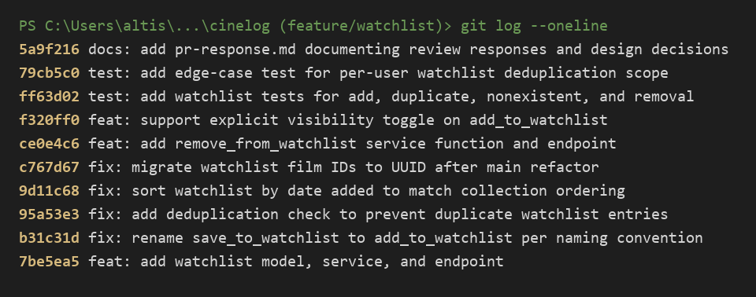

# PR Response Doc — CineLog Watchlist Feature

Thanks for the thorough review. This was a good set of comments -
a couple of them caught things I'd copied a bit too literally from an earlier
draft, and the two design questions were worth stopping to think about rather
than just picking a default. Responses to all six are below, followed by the
PR description and manual testing steps.

A note on sequencing: I addressed the code comments (1, 2, 3) first, made the
two design calls (4, 5), and did the rebase (6) last, once everything else was
stable. The history was then rewritten into conventional commits so each
review response maps to a single, reviewable commit.

---

## AI Usage

I used an AI assistant in three bounded ways, all for orientation and
verification rather than for making decisions:

- **Codebase orientation.** Before reading your comments I had it summarize
  `services/collection_service.py` and walk through `add_to_collection()` step
  by step — specifically what the existence check returns and what it raises on
  a duplicate vs. a missing film. I verified that summary against the actual
  code (the raise paths and the `AlreadyInCollectionError` / `FilmNotFoundError`
  distinction) before I copied the pattern into the watchlist service.
- **Commit-format check.** After the interactive rebase I pasted
  `git log --oneline` in and asked whether every message followed Conventional
  Commits and whether any commit was bundling more than one logical change. It
  flagged nothing, and I re-checked the prefixes against `CONTRIBUTING.md`
  myself.
- **Stress-testing Comments 4 and 5.** I wrote my visibility and sort-order
  positions first, then asked the AI to argue the opposite side — "what would a
  careful reviewer push back with, and what tradeoff am I not naming?" For
  Comment 4 it raised the privacy-by-default / least-astonishment angle harder
  than I had, so I added the explicit acknowledgement that a "want to watch"
  list can still leak signal, and tied the mitigation to the `public` toggle
  from the stretch work. For Comment 5 it pushed the "long lists are hard to
  scan alphabetically-vs-by-date" tradeoff, which I'd already half-addressed;
  I expanded that into the "sort should eventually be a query param" note. The
  positions themselves, and the CineLog-specific reasoning, are mine — the AI
  only pressure-tested them.

---

## Comment 1 — Rename `save_to_watchlist()` → `add_to_watchlist()`

**What I did:**
Renamed the function in `services/watchlist_service.py` and updated its call
site. `CONTRIBUTING.md` documents a `verb_to_noun` convention for service
functions (`add_to_collection`, `remove_from_collection`, `get_collection`),
and `save_to_watchlist` was the odd one out — `save` isn't the verb the rest of
the collection API uses for "put this in the list."

**How I found the call sites / verified none were missed:**
I did a project-wide search for `save_to_watchlist` (`grep -rn "save_to_watchlist"
--include="*.py" .`) rather than trusting memory. That surfaced exactly two
references, both in `routes/watchlist/watchlist.py`: the `from
services.watchlist_service import ...` line and the call inside `add_film()`. I
updated both, then re-ran the same search and confirmed it returns nothing. I
also re-ran the full suite and booted the app (`create_app`) to make sure the
blueprint import didn't break.

---

## Comment 2 — Deduplication

**What I did:**
Added a duplicate check to `add_to_watchlist()` using the same approach as
`add_to_collection()`. Before inserting, it queries for an existing
`WatchlistEntry` with the same `(user_id, film_id)`; if one exists it raises a
new `AlreadyOnWatchlistError` instead of committing a second row. I added that
exception class alongside the service (mirroring `AlreadyInCollectionError`),
and had the `/add` route translate it to a `409 Conflict`, matching how the
collection route handles `AlreadyInCollectionError`.

**What the logic does / what happens on a duplicate:**
`WatchlistEntry.query.filter_by(user_id=user_id, film_id=film_id).first()`
returns the existing entry (or `None`). On a hit, the function raises
`AlreadyOnWatchlistError` and never reaches `db.session.add/commit`, so no
duplicate row is created and the caller gets a clear, catchable error rather
than a silent second insert or a raw DB integrity error.

**Where I looked first:**
I modeled this directly on `add_to_collection()` in
`services/collection_service.py` — it does the film-exists check, then the
`.filter_by(...).first()` existence check, then raises before inserting. I also
noticed `CollectionEntry` carries a `UniqueConstraint("user_id", "film_id")` as
a database-level backstop, so I added the equivalent
`unique_user_film_watchlist` constraint to `WatchlistEntry`. The application
check gives the friendly error; the constraint guarantees correctness even if a
future code path forgets to call through the service.

**How I verified:**
`tests/test_watchlist.py::test_add_to_watchlist_duplicate_raises` adds the same
film twice, asserts `AlreadyOnWatchlistError`, and asserts the row count stays
at 1.

---

## Comment 3 — Missing test

**What I did:**
Created `tests/test_watchlist.py`, modeled on `tests/test_collection.py`. The
comment specifically asked for the nonexistent-`film_id` case, so I wrote
`test_add_to_watchlist_nonexistent_film_raises` as the direct equivalent of
`test_add_to_collection_nonexistent_film_raises`: it calls `add_to_watchlist`
with a UUID that isn't in the DB and asserts `FilmNotFoundError`.

**What it checks / what it's modeled on:**
Same fixtures as `test_collection.py` (`app` with an in-memory SQLite DB,
`sample_user`, `sample_film`) and the same `pytest.raises` assertion style. I
used a syntactically valid but absent UUID (`00000000-0000-0000-0000-000000000000`)
so the test exercises the "film not found" path rather than a type or
integrity error — the same reasoning the collection test uses. While I was in
there I also ported the happy-path, duplicate, and sort-order tests so the
watchlist has the three cases `CONTRIBUTING.md` asks for, plus tests for the
new `remove_from_watchlist()`.

**How I verified:**
`pytest tests/test_watchlist.py -v` — all green — and `pytest tests/ -v` to
confirm the collection tests still pass (11 passing total).

---

## Comment 4 — Default visibility (`public=True`)

**My position:** Keep `public=True` as the default.

**Reasoning (what I'm optimizing for):**
CineLog is described as a *community* film-tracking app, and the watchlist is
the first feature that actually models cross-user visibility — `CollectionEntry`
has no `public` field at all. The value of a watchlist in a community product
isn't just personal bookkeeping; it's the "here's what I'm planning to watch"
signal that feeds discovery, recommendations, and "let's watch this together."
That value only materializes if lists are visible by default. Opt-in sharing
sounds safer, but in practice most users never flip the switch, so a
private-by-default watchlist produces near-empty public feeds and the social
half of the app quietly dies. Defaulting to public is what makes the feature
pull its weight in *this* product.

I also weighed the sensitivity of the data. A watchlist is "films I intend to
watch" — forward-looking intent, closer to a public wishlist than to a viewing
history. That's meaningfully lower-stakes than the collection (what someone has
actually watched), which is exactly why I'm comfortable defaulting the
watchlist to public while I would *not* make the same call for viewing history.

**Tradeoff acknowledged:**
Private-by-default optimizes for privacy and least-astonishment: a user is never
surprised to learn something they added is visible, which is the safer stance
and the one most privacy-conscious norms favor. And I'll grant the sharper
version of that concern — even a "want to watch" list can leak signal (a run of
films around a particular identity, health, or political theme), so "it's only
intent" isn't a complete defense. My take is that the discovery upside is worth
it for a community product *and* that we shouldn't force the choice: the
stretch work in this PR adds an explicit `public` parameter so a user (or the
client) can mark an entry private at add time, and a global "private watchlist
by default" user setting is a reasonable follow-up. So the default optimizes for
the community case, and the toggle covers the users the default doesn't serve.

---

## Comment 5 — Sort order

**My position:** Switch from alphabetical to date-added, newest first. I
implemented it (`fix: sort watchlist by date added to match collection
ordering`).

**Engagement with your point:**
You said "most users want to see what they added recently," and I think that's
right for a watchlist specifically. The mental model for a watchlist is
recency-driven: you add a film *because* you just heard about it — a trailer, a
friend's rec, a review — and the thing you most want when you reopen the app is
"what did I just line up to watch." Alphabetical actively fights that: a film
added thirty seconds ago starting with "Z" lands at the bottom of the list,
which is the opposite of the intent behind adding it.

The other half of the argument, and the reason I didn't just defer to you, is
**consistency with `get_collection()`**, which already sorts
`date_added desc`. Having the two most similar features in the app — collection
and watchlist — order results the same way means users learn one rule, not two.
Before this change, the watchlist sorted by title and the collection sorted by
recency, which is a subtle inconsistency that's hard to name but easy to trip
over. Aligning them is a real UX win independent of which order is "better" in
the abstract.

**Tradeoff acknowledged:**
Alphabetical isn't unreasonable — it's stable and it's the better choice for the
"do I already have *Dune* on here?" scan-for-a-title task, especially on a long
list, and I'd have argued for keeping it if the collection had established
alphabetical as the app's convention. It hasn't. The honest limitation of
date-added is that same long-list lookup case, so the clean long-term answer is
to make sort a query parameter (`?sort=title|date_added`) and default it to
`date_added` — the recency case is the common one, so it should be the default,
but users who want to scan by title shouldn't be stuck. I kept this PR to the
default change and left the query-param as a documented follow-up rather than
scope-creeping it in here.

---

## Comment 6 — Rebase on updated `main`

**What conflicted:**
My branch was cut before the `refactor: migrate film IDs from integer to UUID`
commit landed on `main`. That refactor did two things that collided with the
watchlist code: it changed `Film.id` and `CollectionEntry.film_id` from
`Integer` to `String(36)` UUIDs, and — because the watchlist wasn't on `main`
yet — the version of `models.py` on `main` didn't contain `WatchlistEntry` at
all. So the conflict was fundamentally *integer film IDs vs. UUID film IDs*:
`WatchlistEntry.film_id` was still a `db.Integer` foreign key pointing at what
was now a UUID `Film.id`.

Worth flagging honestly: because my feature commits never touched `models.py`,
`git rebase origin/main` didn't stop with a `<<<<<<<` textual conflict — it
replayed cleanly and *then* the branch was broken. The suite failed at import
(`ImportError: cannot import name 'WatchlistEntry' from 'models'`) once
`models.py` was `main`'s post-refactor version and the type mismatch on
`film_id` remained. That's the real conflict; it just surfaced at
import/runtime rather than as merge markers, which is a good reminder that "the
rebase applied" is not the same as "the rebase is correct."

**How I resolved it:**
I brought `WatchlistEntry` back in line with the post-refactor schema:
`film_id` became `db.String(36)` matching the new `Film.id`, and I updated the
service and route docstrings that still described `film_id` as an `int`. The
`nonexistent_film` test's fake ID is a UUID string, consistent with the new
type. This is the `fix: migrate watchlist film IDs to UUID after main refactor`
commit.

**How I verified no conflict remains:**
- `git log --oneline --graph` and `git log --merges origin/main..HEAD` — the
  branch is linear on top of `main` with zero merge commits.
- `pytest tests/ -v` — 11 passing, including the watchlist tests that exercise
  the UUID `film_id` end to end.
- Booted the app and hit the endpoints manually (see testing steps below) with
  real UUID film IDs.

---

## Stretch work included in this PR

- **`remove_from_watchlist(user_id, film_id)`** — mirrors
  `remove_from_collection()`: it looks up the `(user_id, film_id)` entry, and if
  the film isn't on the watchlist it raises `NotOnWatchlistError` (rather than
  failing silently or returning `False`), otherwise it deletes the row and
  returns `True`. Exposed as `DELETE /watchlist/<user_id>/remove`, which returns
  `404` on that error — same shape as the collection remove endpoint. Covered by
  `test_remove_from_watchlist_removes_entry` and
  `test_remove_from_watchlist_not_present_raises`.
- **Second test (my choice of edge case):**
  `test_add_to_watchlist_dedup_is_per_user`. I chose it because the
  deduplication check keys on `(user_id, film_id)`, and the one way that logic
  can be subtly wrong is if it ever rejected a film that a *different* user
  already has. The test adds the same film to two users' watchlists and asserts
  both succeed and two rows exist — proving the dedup is scoped per user and one
  user's list can't block another's.
- **Visibility toggle:** `add_to_watchlist()` takes an optional `public`
  parameter (default `True`), threaded through the `/add` route via an optional
  `"public"` body field. Omitting it preserves the public-by-default behavior
  from Comment 4; passing `"public": false` creates a private entry. This is the
  mechanism that makes the Comment 4 default a soft default rather than a
  lock-in.

---

## Commit History

The branch was rewritten into conventional commits, one logical change each,
linear on `main` (no merge commits):

```
feat: add watchlist model, service, and endpoint
fix: rename save_to_watchlist to add_to_watchlist per naming convention
fix: add deduplication check to prevent duplicate watchlist entries
fix: sort watchlist by date added to match collection ordering
fix: migrate watchlist film IDs to UUID after main refactor
feat: add remove_from_watchlist service function and endpoint
feat: support explicit visibility toggle on add_to_watchlist
test: add watchlist tests for add, duplicate, nonexistent, and removal
test: add edge-case test for per-user watchlist deduplication scope
docs: add pr-response.md documenting review responses and design decisions
```

Screenshot of `git log --oneline` on `feature/watchlist`:



---

## PR Description

### What this feature does

Adds a **watchlist** to CineLog: a per-user list of films a user wants to watch
later, alongside the existing collection (films they've already watched). Users
can add a film to their watchlist, remove one, and fetch the whole list. It
reuses the collection feature's patterns end to end — same service structure,
same error types, same route shapes — so there's nothing new to learn to
maintain it. Adding a film that's already on the list is rejected with a `409`
instead of silently duplicating, and adding a film that doesn't exist returns a
`404`.

### Design decisions

- **Default visibility: public.** New watchlist entries default to `public=True`
  because CineLog is a community/discovery product and a "want to watch" list is
  low-sensitivity, forward-looking intent. Privacy-conscious users are covered
  by an explicit `public` parameter on add (opt-out per entry). See Comment 4.
- **Sort order: date-added, newest first.** `get_watchlist()` returns entries
  ordered by `date_added desc`, matching `get_collection()` and the recency-
  driven way people actually use a watchlist, rather than alphabetically by
  title. See Comment 5.

### API

| Method | Route | Body | Success |
|--------|-------|------|---------|
| `GET`  | `/watchlist/<user_id>` | — | `200` list of films (newest first) |
| `POST` | `/watchlist/<user_id>/add` | `{"film_id": "<uuid>", "public": true}` (`public` optional) | `201` created entry |
| `DELETE` | `/watchlist/<user_id>/remove` | `{"film_id": "<uuid>"}` | `200` removed |

### How to manually test

Prerequisites:

```bash
python -m venv .venv
source .venv/Scripts/activate     # Windows Git Bash; use .venv/bin/activate on macOS/Linux
pip install -r requirements.txt
python app.py                     # serves http://127.0.0.1:5000
```

There's no seed data or admin create-film endpoint, so create a user and a film
directly, then grab their UUIDs (run in a second terminal, same venv):

```bash
python - <<'PY'
from app import create_app, db
from models import User, Film
app = create_app()
with app.app_context():
    u = User(username="tester", email="tester@example.com")
    f = Film(title="Dune", year=2021, genre="Sci-Fi")
    db.session.add_all([u, f]); db.session.commit()
    print("USER_ID =", u.id)
    print("FILM_ID =", f.id)
PY
```

Then exercise the endpoints (substitute the printed UUIDs):

1. **Add to watchlist** — expect `201` and the entry JSON:
   ```bash
   curl -X POST http://127.0.0.1:5000/watchlist/<USER_ID>/add \
        -H "Content-Type: application/json" -d '{"film_id": "<FILM_ID>"}'
   ```
2. **View watchlist** — expect `200` and a one-film list, newest first:
   ```bash
   curl http://127.0.0.1:5000/watchlist/<USER_ID>
   ```
3. **Duplicate is rejected** — repeat step 1; expect `409` and an
   "already on this user's watchlist" error (and the list in step 2 still shows
   one entry).
4. **Nonexistent film** — expect `404`:
   ```bash
   curl -X POST http://127.0.0.1:5000/watchlist/<USER_ID>/add \
        -H "Content-Type: application/json" \
        -d '{"film_id": "00000000-0000-0000-0000-000000000000"}'
   ```
5. **Private entry (visibility toggle)** — add a second film with
   `{"film_id": "<FILM_ID_2>", "public": false}`; the returned JSON should show
   `"public": false`.
6. **Remove from watchlist** — expect `200`, then confirm the film is gone from
   step 2's list:
   ```bash
   curl -X DELETE http://127.0.0.1:5000/watchlist/<USER_ID>/remove \
        -H "Content-Type: application/json" -d '{"film_id": "<FILM_ID>"}'
   ```
7. **Remove something not on the list** — repeat step 6; expect `404`.

Automated coverage: `pytest tests/ -v` (11 passing — 4 collection, 7 watchlist).
